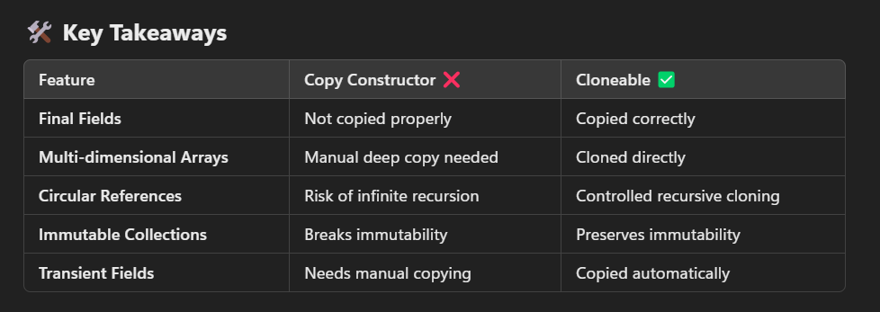

            /*
            * Q. What is a deep copy?
            * A :
            *
            * Q. How Java provides access to clone()?
            *
            *
            * Q. What does clone() actually do?
            *
            * */

Absolutely! Spawning new characters before the showdown is another thrilling use case. In this scenario, the game engine could use cloning to quickly generate multiple instances of enemies or allies from a prototype. Instead of constructing each character from scratch, the engine clones an existing prototype—ensuring that each spawned character starts with the same complex state (like abilities, combo moves, and buffs) but can later diverge based on gameplay. This not only improves performance but also keeps the game mechanics clean and flexible.

ALWAYS HAVING AN ABSTRACT METHOD FOR CLONING IN THE ABSTRACT CLASS OR INTERFACE is absolutely not needed.

