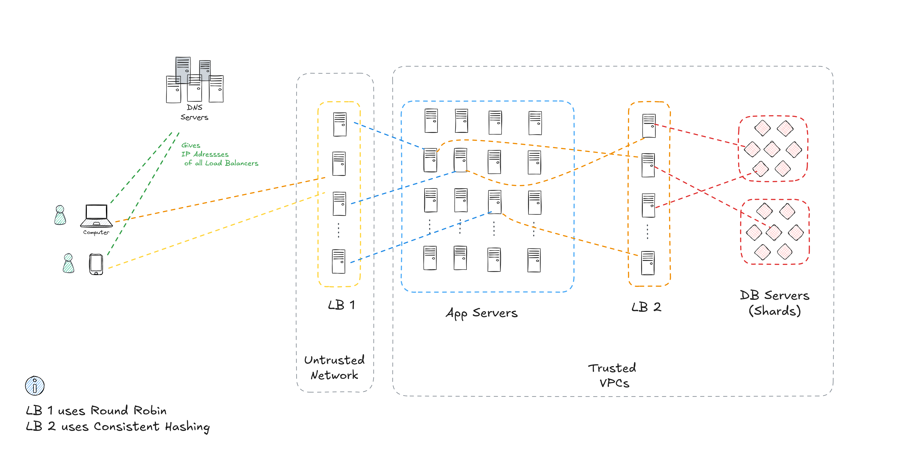

# Load Balancers

## Tasks
1. Provides a unified view of the backend to the user (single point of contact).
2. Distributes the load evenly across all servers.

## Health Check / Heartbeat
- Monitors server health to route traffic only to healthy servers.

## Scalability at Google Scale
- **Problem**: Single LB can become a bottleneck.
- **Solution**: Use multiple Load Balancers.
  - Assist with **DNS** to distribute traffic across multiple LBs.

---
# Load Balancing Algorithms

## 1. Round Robin
### How it works 
Distributes requests **sequentially across server in a cyclic manner**.
### Use Case
Suitable for **stateless servers with uniform workloads**.
### Limitation
Can lead to **uneven distribution if server capacities differ or workloads vary**.

## 2. Weighted Round Robin
### How it works 
Assigns **weights to the servers** **based on their capacities and distribute requests proportionally**.
### Use Case
When servers have **varying processing power or capacity**.
### Limitation
Requires **proper weight tuning and monitoring**.

## 3. Least Connections
### How it works
Routes requests to the server with the fewest active connections
### Use Case
Best for stateful applications where connection duration varies
### Limitation
May not account for server capacity differences.

## 4. Consistent Hashing
### How it works
Uses a hash function to map requests (e.g. keys, userIDs, etc.) to specific servers.
Minimizes remapping during node additions/removals.
### Use Case
Ideal for distributed storage systems, caches, or databases.
### Limitation
Can lead to uneven load if not tuned or if data distribution is skewed.

## 5. IP Hash
### How it works 
Maps client IP addresses to specific servers using a hash function, ensuring requests from the same client are routed to the same server.
### Use Case
Useful for maintaining session consistency in stateful systems.
### Limitation
Can lead to uneven load distribution

## 6. Random
### How it works 
Assigns requests to a random server.
### Use Case
Simple to implement works well with large number of evenly loaded servers.
### Limitation
Not efficient for uneven server capacities or stateful applications.

## 7. Least Response Times
### How it works 
Routes requests to the server with the least response time, combining connection count and real-time performance.
### Use Case
Dynamic systems where server response times vary frequently.
### Limitation
Overhead of measuring response times.

## 8. Adaptive Load Balancing
### How it works 
Dynamically adjusts routing based on real-time server performance metrics (e.g. CPU load, memory usage).
### Use Case
Complex systems with fluctuating workloads.
### Limitation
Requires sophisticated monitoring and tuning.

## What's Important?
1. Understanding how each algorithm works and when to use it.
2. Discussing the trade-offs: pros and cons, and real-world scenarios.
3. Choosing the right algorithm based on system requirements, e.g. stateless vs. stateful, uniform vs. non-uniform, etc.
4. Addressing how algorithms handle node additions/removals and failures.

---

# General guideline for Choosing the Correct LB Strategy

### 1. Load Balancers for App Servers (Stateless): Round Robin Approach

#### Reason for Round Robin:
- App servers typically handle stateless requests, meaning each request is independent and do not require knowledge of previous interactions. 
- Round Robin is a simple and efficient algorithm that distributes requests evenly across the app servers, ensuring load is balanced in an unbiased manner.
- NOTE: This approach **works well when the requests are of similar size** and **the app servers have roughly equivalent capacity**.

#### ⚠️ When to Consider Alternatives:
- If **requests are not uniform in size**, consider **Weighted Round Robin** **or Least Connections** to account for differences in server capacities or current load. 
---
### 2. Load Balancers for Data Servers (Stateful): Consistent Hashing

#### Reason for Consistent Hashing
- Data Servers often store state (e.g., user data, cached content) and need requests routed to the server holding the relevant state.
- Consistent Hashing ensures that requests for the same data (e.g. identified by a key) are consistently routed to the same server. This minimizes cache misses and reduces the overhead or re-distributing data across servers when nodes are added or removed.
- This is especially critical in distributed systems like distributed caches (e.g., Redis cluster) or distributed databases.

#### ⚠️ When to Consider Alternatives:
- If the **system allows for full replication of data across all nodes**, any **node can handle any request**, and consistent hashing may not be necessary. 
- In scenarios where the **latency of re-distributing data due to node changes is tolerable**, **simpler approaches** **might suffice.**

---